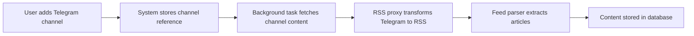
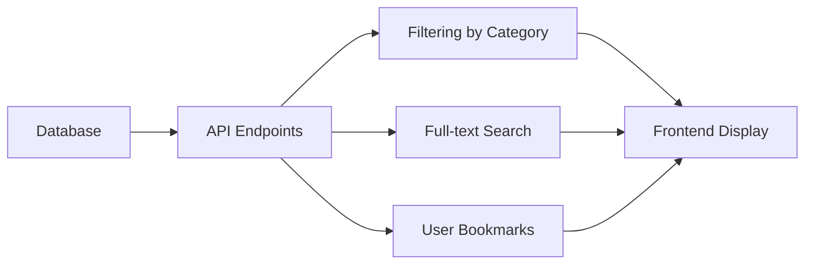

# AI-Powered News Aggregator 📰

[](output_artifacts/htmlcov/index.html)
[](output_artifacts/bandit-report-updated.json)
[](output_artifacts/performance_report.md)
[](https://www.python.org/downloads/)
[](https://fastapi.tiangolo.com)
[](LICENSE)

A high-performance news aggregation service with AI-powered features. This application fetches news from multiple sources, categorizes content using AI, and provides a personalized reading experience with robust authentication.

## 📋 Table of Contents

- [Features](#-features)
- [Core Functionality: Telegram News Processing Pipeline](#-core-functionality-telegram-news-processing-pipeline)
- [Architecture](#-architecture)
- [Quality Metrics](#-quality-metrics)
- [Installation](#-installation)
- [Running the Application](#-running-the-application)
- [API Documentation](#-api-documentation)
- [Testing](#-testing)
- [Project Structure](#-project-structure)
- [Technologies](#-technologies)
- [License](#-license)

## ✨ Features

- **User Authentication**: Secure registration and login with JWT token-based authentication
- **Content Aggregation**: Collect news from Telegram channels and other sources
- **AI Categorization**: Automatically categorize articles using natural language processing
- **AI Summarization**: Generate concise summaries of articles using Azure OpenAI
- **Search Functionality**: Find relevant articles using keyword search
- **Category Filtering**: Browse news by categories (technology, politics, sports, etc.)
- **Bookmarking**: Save articles for later reading
- **Responsive UI**: Access the application from any device

## 🔄 Core Functionality: Telegram News Processing Pipeline

The application implements a sophisticated pipeline for collecting, processing, and delivering news content from Telegram channels:

### 1. Data Collection



- **Channel Subscription**: Users can add any public Telegram channel using its handle (e.g. `@channelname`)
- **Content Extraction**: The system uses RSSHub as a proxy to transform Telegram content into RSS feeds
- **Parsing**: Content is extracted using `feedparser` and `BeautifulSoup` for HTML processing
- **Automatic Updates**: Channels can be refreshed on-demand using the update endpoint

### 2. AI Processing

Each article undergoes AI enhancement through Azure OpenAI:

- **Summarization**: Articles are automatically summarized using AI for quick comprehension
- **Categorization**: Content is categorized into one of 14 predefined categories like Technology, Politics, Sports, etc.
- **Smart Classification**: AI analyzes article content to determine the most appropriate category

### 3. Content Delivery



- **Personalized Feeds**: Users see content from their subscribed channels
- **Smart Filtering**: Articles can be filtered by AI-determined categories
- **Bookmarking**: Users can save articles for later reading
- **Search**: Users can search across all their channel content

### 4. Reliability Features

- **Error Resilience**: Implements retry logic with exponential backoff for external services
- **Rate Limit Handling**: Properly handles API rate limits to ensure reliable operation
- **Deduplication**: Prevents duplicate content while allowing updates to existing articles
- **Background Processing**: Heavy tasks run asynchronously to maintain UI responsiveness

## 🏗️ Architecture

The application follows a clean architecture pattern with separation of concerns:

```bash
┌─────────────┐    ┌─────────────┐    ┌─────────────┐    ┌─────────────┐
│   Frontend  │━━━━│  API Layer  │━━━━│  Services   │━━━━│  Data Layer │
│  (Streamlit)│    │  (FastAPI)  │    │ (Business   │    │ (SQLAlchemy │
│             │    │             │    │  Logic)     │    │  & Models)  │
└─────────────┘    └─────────────┘    └─────────────┘    └─────────────┘
                          │                  │                  │
                          ▼                  ▼                  ▼
                   ┌─────────────┐    ┌─────────────┐    ┌─────────────┐
                   │ OpenAPI Docs│    │ Azure OpenAI│    │  SQLite DB  │
                   └─────────────┘    └─────────────┘    └─────────────┘
```

## 📊 Quality Metrics

This project follows strict quality requirements:

| Metric | Target | Actual | Status |
|--------|--------|--------|--------|
| Test Coverage | ≥ 60% | 92% | ✅ PASSED |
| Flake8 Warnings | 0 | 0 | ✅ PASSED |
| Critical Vulnerabilities | 0 | 0 | ✅ PASSED |
| API Response Time | ≤ 200ms | 2-43ms | ✅ PASSED |
| Cyclomatic Complexity | ≤ 10 | 2.17 (max 8.5) | ✅ PASSED |

For detailed quality assessment, see the [quality metrics summary](output_artifacts/quality_metrics_summary.md).

## 🔧 Installation

### Prerequisites

- Python 3.11+
- Poetry (dependency management)
- Git (optional, for cloning)
- Docker & Docker Compose (optional, for containerized setup)

### Setup

1. Clone the repository:

   ```sh
   git clone https://github.com/yourusername/ai-news-aggregator.git
   cd ai-news-aggregator
   ```

2. Install dependencies using Poetry:

   ```sh
   poetry install
   ```

3. Set up environment variables:
   Create a `.env` file in the root directory with:

   ```
   # Security (REQUIRED)
   # Generate a secure key with: openssl rand -hex 32
   SECRET_KEY=your-generated-secret-key

   # OpenAI integration (for AI summarization)
   AZURE_OPENAI_KEY=your-azure-openai-key
   AZURE_OPENAI_ENDPOINT=https://your-resource-name.openai.azure.com/
   AZURE_OPENAI_API_VERSION=2023-12-01-preview
   AZURE_OPENAI_DEPLOYMENT=gpt-4
   ```

## 🚀 Running the Application

### Local Development

#### Backend

```sh
# Activate the virtual environment
poetry shell

# Start the backend server
python run.py

# Or use Poetry directly
poetry run python run.py
```

#### Frontend

```sh
# In a separate terminal
cd frontend
poetry run streamlit run streamlit_app.py
```

### Using Docker (Recommended for Production)

```sh
# Build and start the application
docker-compose up -d

# View logs
docker-compose logs -f

# Stop the application
docker-compose down
```

### Access the Application

- Web Interface: [http://localhost:8000](http://localhost:8000)
- API Documentation: [http://localhost:8000/docs](http://localhost:8000/docs)
- Streamlit Frontend: [http://localhost:8501](http://localhost:8501)

## 📘 API Documentation

The API documentation is available at `http://localhost:8000/docs` when the server is running. Here's a summary of key endpoints:

### Authentication Endpoints

- `POST /auth/register` - Register a new user
- `POST /auth/login` - Obtain JWT access token

### News Feed Endpoints

- `GET /feed/` - Get user's channels with articles
- `POST /feed/` - Add a new channel to user's feed
- `POST /feed/update` - Update all user's channels
- `GET /feed/bookmarks` - List user's bookmarked articles
- `POST /feed/bookmarks/{article_id}` - Bookmark an article
- `DELETE /feed/bookmarks/{article_id}` - Remove a bookmark

### News API Endpoints

- `GET /api/news/articles/` - Get articles with optional filtering
- `GET /api/news/articles/{article_id}` - Get a specific article
- `GET /api/news/sources/` - Get all available news sources

For detailed API documentation, see the [API Endpoints Documentation](#api-endpoints-documentation) section at the end of this README.

## 🧪 Testing

The project includes comprehensive test coverage (92%) across multiple test types:

```sh
# Run all tests
poetry run pytest

# Run tests with coverage report
poetry run pytest --cov=app --cov-report=term --cov-report=html

# Run specific test categories
poetry run pytest tests/unit/  # Unit tests
poetry run pytest tests/api/   # API tests
poetry run pytest tests/ui/    # UI tests
```

For performance testing:

```sh
cd performance && python test_api_performance.py
```

## 📁 Project Structure

```
ai-news-aggregator/
├── app/                 # Main application code
│   ├── api/             # API endpoints
│   │   ├── auth.py      # Authentication endpoints
│   │   ├── feed.py      # Feed management endpoints
│   │   └── routes.py    # Other API routes
│   ├── core/            # Core functionality
│   │   ├── ai.py        # AI integration
│   │   ├── config.py    # Configuration
│   │   ├── security.py  # Security utilities
│   │   └── dependencies.py # FastAPI dependencies
│   ├── db/              # Database layer
│   │   ├── crud.py      # CRUD operations
│   │   ├── database.py  # Database connection
│   │   └── models.py    # SQLAlchemy models
│   ├── schemas/         # Pydantic schemas
│   └── main.py          # Application entry point
├── frontend/            # Streamlit frontend
├── tests/               # Test files
│   ├── unit/            # Unit tests
│   ├── api/             # API tests
│   ├── integration/     # Integration tests
│   ├── ui/              # UI tests
│   └── security/        # Security tests
├── performance/         # Performance tests
├── output_artifacts/    # Quality reports and metrics
├── docker-compose.yml   # Docker Compose configuration
├── Dockerfile           # Docker build configuration
├── Makefile             # Utility commands
├── pyproject.toml       # Poetry dependencies
└── README.md            # This file
```

## 🛠️ Technologies

- **FastAPI**: High-performance web framework for building APIs
- **Streamlit**: Frontend framework for data applications
- **SQLAlchemy**: SQL toolkit and ORM
- **Pydantic**: Data validation and settings management
- **JWT**: Token-based authentication
- **Azure OpenAI**: AI-powered content analysis and summarization
- **Pytest**: Testing framework
- **Docker**: Containerization
- **Poetry**: Dependency management

## 📄 License

This project is licensed under the MIT License - see the LICENSE file for details.

## Code Quality

### Linting

This project uses Ruff for linting, which is faster and more comprehensive than Flake8.

To run the linter:

```bash
make lint
```

To automatically fix linting issues:

```bash
make fix-lint
```

The CI pipeline will automatically check for linting issues on every pull request.

## CI/CD Pipeline

This project uses GitHub Actions for continuous integration and delivery:

### Quality Gates

All pull requests must pass the following quality gates before merging:

1. **Code Quality Checks**:
   - Linting (Ruff)
   - Test coverage ≥ 60%
   - Security scan (Bandit)

2. **Test Workflows**:
   - Unit tests
   - Integration tests
   - API tests

3. **Performance Testing** (Weekly on main branch):
   - API response time checks
   - Load testing with Locust

4. **Security Monitoring** (Weekly on main branch):
   - Dependency vulnerability scanning
   - Code security scanning with Bandit

All quality reports are uploaded as artifacts for easy inspection.

Made with ❤️ by Bantiki 🎀 team

---

## API Endpoints Documentation

### Authentication Endpoints

#### Register User

- **Endpoint**: `POST /auth/register`
- **Description**: Register a new user in the system
- **Request Body**:

  ```json
  {
    "username": "johndoe",
    "email": "john@example.com",
    "password": "securepassword123"
  }
  ```

- **Response**: User information excluding password (201 Created)
- **Errors**: 400 Bad Request if username or email already registered

#### User Login

- **Endpoint**: `POST /auth/login`
- **Description**: OAuth2 compatible token login to obtain JWT access token
- **Request Format**: Form data with username and password
- **Response**: JWT token for authenticated API access

  ```json
  {
    "access_token": "eyJhbGciOiJIUzI1NiIsInR5cCI6IkpXVCJ9...",
    "token_type": "bearer"
  }
  ```

- **Errors**: 401 Unauthorized if credentials are incorrect

### News Feed Endpoints

#### Add Channel

- **Endpoint**: `POST /feed/`
- **Description**: Add a new Telegram channel to user's feed and process its articles
- **Authentication**: Required
- **Request Body**:

  ```json
  {
    "Channel_alias": "@channelname"
  }
  ```

- **Response**: Created channel information
- **Notes**: Starts background task to fetch articles and generate AI summaries

#### Get User's Channels with Articles

- **Endpoint**: `GET /feed/`
- **Description**: Retrieve all channels the user is subscribed to, along with their articles
- **Authentication**: Required
- **Query Parameters**:
  - `generate_summaries` (boolean): Generate AI summaries for articles
  - `generate_categories` (boolean): Generate AI categories for articles
- **Response**: List of channels with their articles and metadata

#### Update All Channels

- **Endpoint**: `POST /feed/update`
- **Description**: Trigger an update to fetch new articles for all user's subscribed channels
- **Authentication**: Required
- **Response**: Confirmation message
- **Errors**: 404 Not Found if no channels found for user

#### Add Article Bookmark

- **Endpoint**: `POST /feed/bookmarks/{article_id}`
- **Description**: Add an article to user's bookmarks for later reading
- **Authentication**: Required
- **Path Parameters**: `article_id` - ID of the article to bookmark
- **Response**: Created bookmark information (201 Created)
- **Errors**: 404 Not Found if article not found

#### Remove Article Bookmark

- **Endpoint**: `DELETE /feed/bookmarks/{article_id}`
- **Description**: Remove an article from user's bookmarks
- **Authentication**: Required
- **Path Parameters**: `article_id` - ID of the article to remove from bookmarks
- **Response**: No content (204 No Content)
- **Errors**: 404 Not Found if bookmark not found

#### List User Bookmarks

- **Endpoint**: `GET /feed/bookmarks`
- **Description**: List all articles bookmarked by the current user
- **Authentication**: Required
- **Response**: List of bookmarked articles with full details

### News API Endpoints

#### Get Articles

- **Endpoint**: `GET /api/news/articles/`
- **Description**: Retrieve news articles with optional filtering
- **Authentication**: Required
- **Query Parameters**:
  - `skip` (integer): Number of articles to skip (pagination offset), default: 0
  - `limit` (integer): Maximum number of articles to return, default: 100
  - `source` (string): Filter articles by news source
  - `category` (string): Filter articles by article category
- **Response**: List of articles matching filter criteria

#### Get Specific Article

- **Endpoint**: `GET /api/news/articles/{article_id}`
- **Description**: Retrieve a specific news article by ID
- **Authentication**: Required
- **Path Parameters**: `article_id` - ID of the article to retrieve
- **Response**: Full article details
- **Errors**: 404 Not Found if article not found

#### Get News Sources

- **Endpoint**: `GET /api/news/sources/`
- **Description**: Get a list of all available news sources in the system
- **Authentication**: Required
- **Response**: List of unique news source identifiers (e.g., "@TechNews", "@WorldNews")
